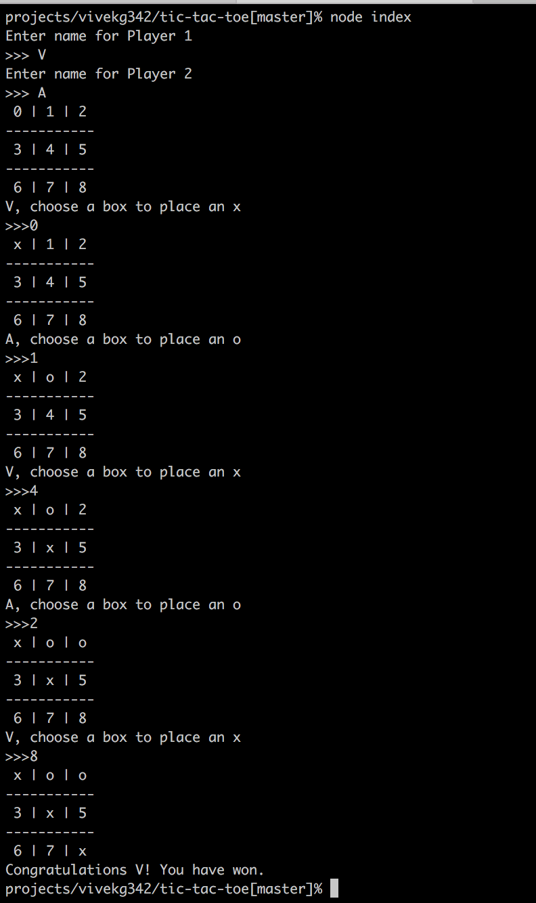

### Tic Tac Toe

Purpose of this project is to create an interactive Tic Tac Toe via command line.

### Running the program

To create a 3*3 board
```
npm install
node index
```

To create a n*n board command line argument `n` can be passed
and another field `k` to control number of consecutive squares to win.

```
node index -n 10 -k 3
```

